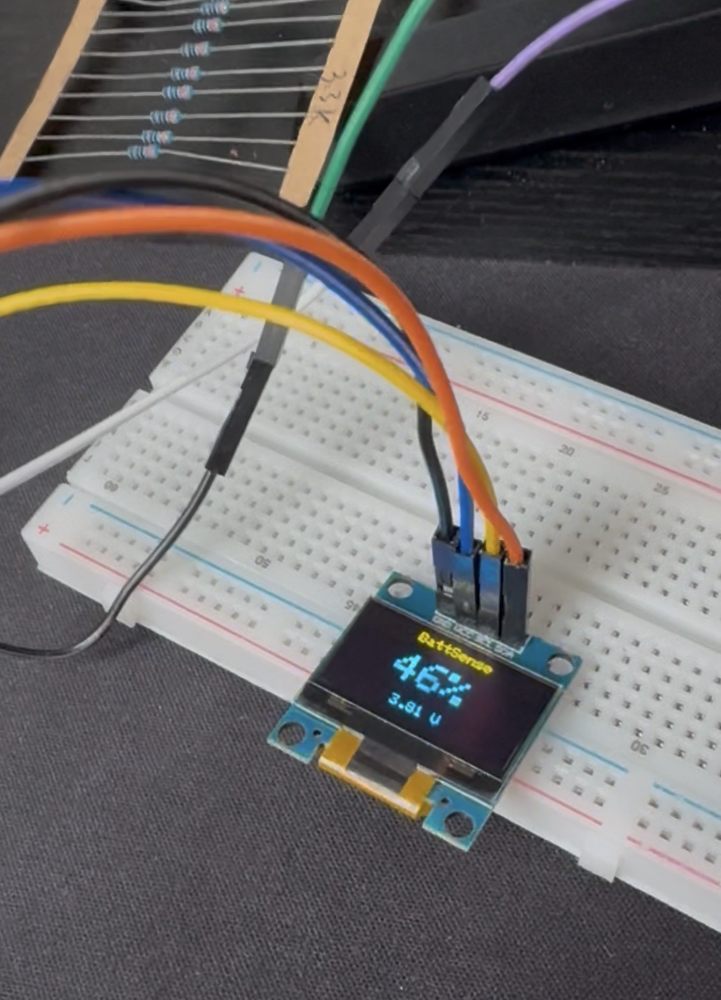
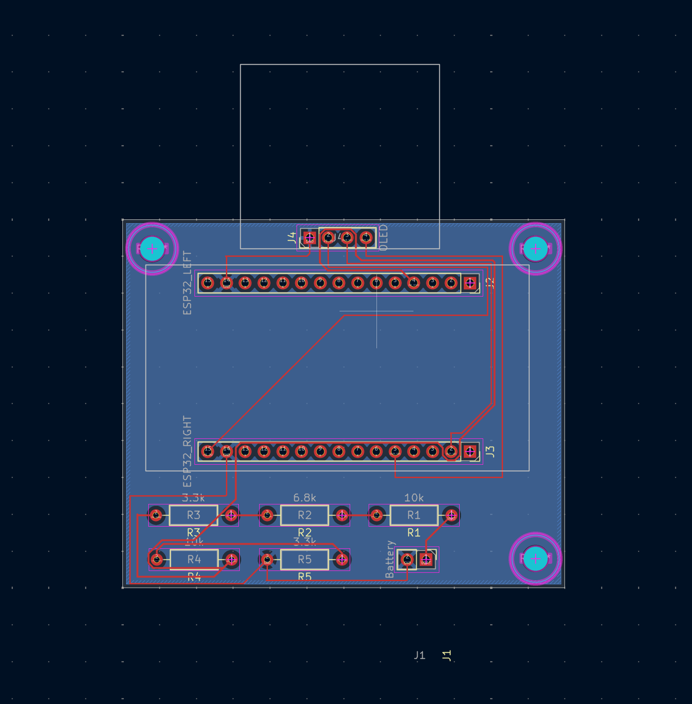

# BattSense

**ESP32 Li-ion battery monitor with voltage-based state-of-charge estimation, a custom KiCad PCB, OLED interface, and unit-tested firmware.**



BattSense is an embedded battery-monitoring system for a single-cell Li-ion battery. It measures battery voltage through a resistive analog front end, estimates battery state of charge (SoC), and displays the result locally on an OLED.

The project was developed from circuit design and breadboard validation through modular firmware, automated testing, PCB design, and enclosure development.

## Features

- Single-cell Li-ion battery voltage measurement
- ESP32 ADC acquisition on GPIO34
- Custom resistive analog front end
- ADC sample averaging
- Voltage-based state-of-charge estimation
- OCV-SoC lookup table with piecewise-linear interpolation
- 128×64 I2C OLED interface
- Modular C++ firmware
- Native unit testing with PlatformIO and Unity
- GitHub Actions continuous integration
- Custom 2-layer KiCad PCB
- Removable ESP32 DevKit architecture
- Through-hole design for hand assembly

## System Architecture

```text
          18650 Li-ion Cell
                  |
                  v
        Analog Voltage Divider
          20.1 kΩ / 13.3 kΩ
                  |
                  v
             GPIO34 ADC
                  |
                  v
           BatteryMonitor
                  |
           Battery Voltage
                  |
                  v
      StateOfChargeEstimator
                  |
           Estimated SoC
                  |
                  v
           DisplayManager
                  |
                  v
          128×64 I2C OLED
```

The firmware separates measurement, battery modeling, and presentation into independent modules.

## Hardware

### Analog Front End

The ESP32 measures the battery through a passive resistive divider.

Rev A uses:

```text
R_UPPER = 20.1 kΩ
R_LOWER = 13.3 kΩ
```

At a maximum single-cell Li-ion voltage of 4.2 V:

\[
V_{ADC}
=
4.2
\left(
\frac{13.3}
{20.1+13.3}
\right)
\approx
1.67V
\]

The divider presents a Thevenin resistance of approximately:

\[
R_{TH}
=
20.1k\Omega \parallel 13.3k\Omega
\approx
8.0k\Omega
\]

to the ESP32 ADC.

### Schematic


The KiCad design includes:

- Battery input
- Voltage-divider analog front end
- Removable 30-pin ESP32 DevKit interface
- OLED I2C interface
- Power and ground connections

Additional analog-front-end documentation is available in [`docs/analog_front_end.md`](docs/analog_front_end.md).

## PCB Design

BattSense Rev A includes a custom **60 mm × 50 mm, 2-layer carrier PCB** designed in KiCad.

### PCB Layout



### 3D Render


The PCB includes:

- Two 1×15 female sockets for a removable ESP32 DevKit
- Through-hole analog-front-end components
- OLED interface
- Battery interface
- B.Cu ground plane
- Three M3 enclosure mounting holes
- ESP32 orientation for left-side USB access

The completed layout passes KiCad design-rule checking with:

```text
Unrouted connections: 0
DRC violations:       0
```

Gerber and drill files have also been generated for Rev A fabrication.

## Firmware Architecture

The firmware is separated into dedicated modules:

```text
BatteryMonitor
      |
      | battery voltage
      v
StateOfChargeEstimator
      |
      | estimated SoC
      v
DisplayManager
      |
      v
OLED
```

### BatteryMonitor

Responsible for:

- ESP32 ADC configuration
- ADC acquisition
- Sample averaging
- ADC-voltage conversion
- Voltage-divider compensation
- Battery-voltage reporting

### StateOfChargeEstimator

Converts measured battery voltage into an estimated state of charge.

### DisplayManager

Presents battery voltage and estimated SoC on the OLED.

## State-of-Charge Estimation

BattSense Rev A uses a **voltage-based state-of-charge estimator**.

A Li-ion open-circuit-voltage versus state-of-charge lookup table is stored in firmware. When the measured voltage falls between two table entries, BattSense performs piecewise-linear interpolation.

For neighboring lookup points:

\[
(V_1,SOC_1)
\]

and

\[
(V_2,SOC_2)
\]

the interpolation factor is:

\[
t =
\frac{V-V_1}
{V_2-V_1}
\]

and the estimated state of charge is:

\[
SOC =
SOC_1 +
t(SOC_2-SOC_1)
\]

Values outside the lookup-table range are clamped to 0% or 100%.

The estimator is independent of ESP32 hardware, allowing it to be tested natively on a development machine.

> **Note:** Voltage-based SoC is an estimate rather than precision fuel gauging. Terminal voltage is affected by cell chemistry, temperature, aging, load current, and relaxation state.

See [`docs/state_of_charge.md`](docs/state_of_charge.md) for additional information about the model and its limitations.

## Testing

The SoC estimator is tested using Unity through PlatformIO's native environment.

Current tests cover:

- Lower-voltage clamping
- Upper-voltage clamping
- Exact lookup-table points
- 100% boundary behavior
- Piecewise-linear interpolation

Current result:

```text
5 test cases
5 succeeded
0 failed
```

Run the tests locally with:

```bash
cd firmware
pio test -e native
```

## Building the Firmware

BattSense uses PlatformIO with the Arduino ESP32 framework.

Clone the repository:

```bash
git clone https://github.com/akurmapr-create/BattSense.git
cd BattSense/firmware
```

Build the ESP32 firmware:

```bash
pio run -e esp32dev
```

Upload to a connected ESP32:

```bash
pio run -e esp32dev --target upload
```

Open the serial monitor:

```bash
pio device monitor
```

## Continuous Integration

BattSense uses GitHub Actions to automatically build and test the firmware on pushes and pull requests.

[](https://github.com/akurmapr-create/BattSense/actions/workflows/firmware.yml)

## Development Process

BattSense has been developed iteratively using physical hardware rather than only simulation.

```text
Requirements
    |
    v
Circuit Design
    |
    v
Breadboard Prototype
    |
    v
Measurement
    |
    v
Failure Identification
    |
    v
Design Revision
    |
    v
Validation
```

The analog front end, ADC acquisition, state-of-charge estimation, OLED interface, and PCB were developed and validated incrementally.

## Repository Structure

```text
BattSense/
|
├── .github/
│   └── workflows/
│       └── firmware.yml
|
├── docs/
│   ├── analog_front_end.md
│   ├── calculations.md
│   └── state_of_charge.md
|
├── firmware/
│   ├── include/
│   ├── src/
│   ├── test/
│   └── platformio.ini
|
├── hardware/
│   └── schematics/
│       └── BattSense_AFE/
|
├── images/
│   ├── battsense_prototype.jpeg
│   ├── battsense_schematic.png
│   ├── battsense_pcb.png
│   └── battsense_pcb_3d.png
|
└── README.md
```

## Rev A Status

- [x] Battery-voltage analog front end
- [x] Breadboard validation
- [x] ESP32 ADC integration
- [x] ADC averaging
- [x] State-of-charge estimator
- [x] SoC unit tests
- [x] OLED integration
- [x] GitHub Actions CI
- [x] KiCad schematic
- [x] Custom 2-layer PCB
- [x] ERC / DRC validation
- [x] Gerber generation
- [ ] Permanent perfboard assembly
- [ ] SolidWorks enclosure
- [ ] Final voltage validation with reference multimeter

## Roadmap

### Rev A

Complete the physical prototype:

- Assemble the permanent perfboard implementation
- Design and 3D-print the SolidWorks enclosure
- Mount the OLED and battery holder
- Complete final electrical validation

### Future Revisions

Potential improvements include:

- Cell-specific OCV-SoC characterization
- Current sensing
- Coulomb counting
- Temperature compensation
- Load-compensated SoC estimation
- Dedicated fuel-gauge evaluation
- Custom integrated ESP32 PCB

## Tools

- ESP32
- C++ / Arduino
- PlatformIO
- Unity
- GitHub Actions
- KiCad
- SolidWorks
- Git / GitHub