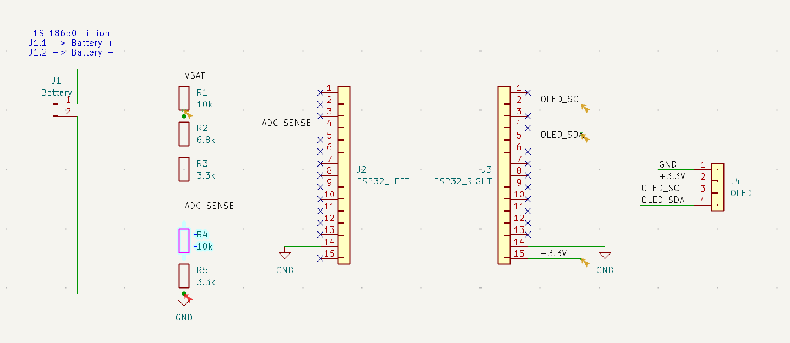
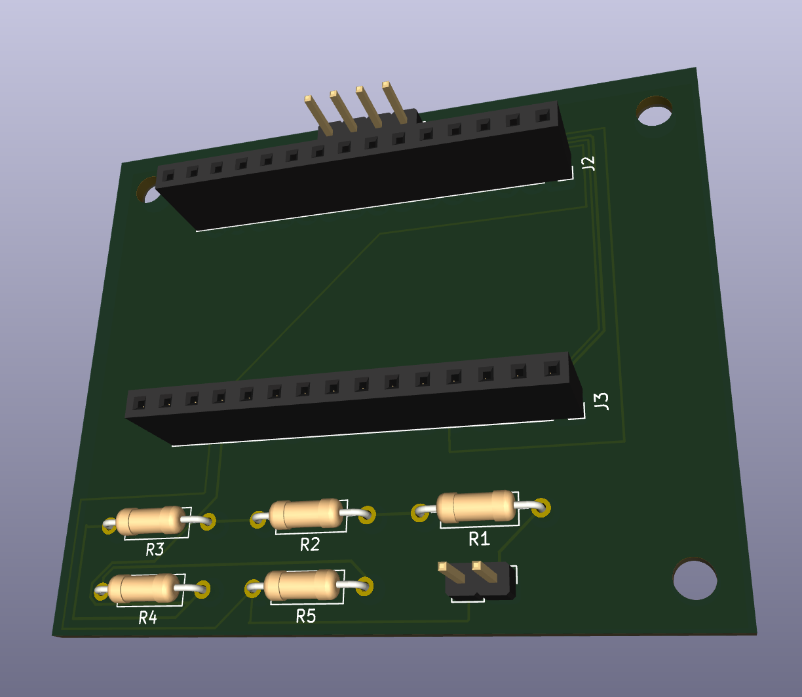

# BattSense

**ESP32-based Li-ion battery monitor with voltage-based state-of-charge estimation, a custom KiCad PCB, OLED interface, and unit-tested firmware.**


BattSense is an embedded battery-monitoring system for a single-cell Li-ion battery. It measures battery voltage through a custom analog front end, estimates battery state of charge (SoC), and displays the result locally on an OLED.

The project was developed from circuit design and breadboard validation through modular firmware, automated testing, PCB design, and enclosure development.

---

## Features

- Single-cell Li-ion battery voltage measurement
- ESP32 ADC acquisition on GPIO34
- Custom resistive analog front end
- 16-sample ADC averaging
- Voltage-based state-of-charge estimation
- OCV-SoC lookup table with piecewise-linear interpolation
- 128×64 I2C OLED interface
- Modular C++ firmware architecture
- Native unit testing with PlatformIO and Unity
- GitHub Actions continuous integration
- Custom 2-layer KiCad PCB
- Removable ESP32 DevKit architecture
- Through-hole design for hand assembly

---

## System Architecture

```text
          18650 Li-ion Cell
                  |
                  v
        Analog Voltage Divider
          20.1 kΩ / 13.3 kΩ
                  |
                  v
             GPIO34 ADC
                  |
                  v
           BatteryMonitor
                  |
           Battery Voltage
                  |
                  v
      StateOfChargeEstimator
                  |
           Estimated SoC
                  |
                  v
           DisplayManager
                  |
                  v
          128×64 I2C OLED
```

The firmware separates measurement, battery modeling, and presentation into independent modules.

---

## Hardware

### Analog Front End

The ESP32 measures the battery through a passive resistive divider.

The current Rev A divider uses:

```text
R_UPPER = 20.1 kΩ
R_LOWER = 13.3 kΩ
```

At the maximum expected Li-ion voltage of 4.2 V:

\[
V_{ADC}
=
4.2
\left(
\frac{13.3}
{20.1+13.3}
\right)
\approx
1.67V
\]

The divider presents approximately:

\[
R_{TH}
=
20.1k\Omega \parallel 13.3k\Omega
\approx
8.0k\Omega
\]

to the ESP32 ADC.

### Schematic



The complete KiCad design includes:

- Battery input
- Voltage-divider analog front end
- Removable 30-pin ESP32 DevKit interface
- OLED I2C interface
- Power and ground connections

Detailed analog-front-end calculations are available in [`docs/analog_front_end.md`](docs/analog_front_end.md).

---

## PCB

BattSense Rev A includes a custom **60 mm × 50 mm, 2-layer carrier PCB** designed in KiCad.



The PCB includes:

- Two 1×15 female sockets for a removable ESP32 DevKit
- Through-hole analog-front-end components
- OLED interface
- Battery interface
- B.Cu ground plane
- Three M3 enclosure mounting holes
- Left-facing ESP32 USB access

The completed layout passes KiCad DRC with:

```text
Unrouted connections: 0
DRC violations:       0
```

Gerber and drill files are included in the hardware directory.

---

## Firmware Architecture

The firmware is divided into independent modules:

```text
BatteryMonitor
      |
      | battery voltage
      v
StateOfChargeEstimator
      |
      | estimated SoC
      v
DisplayManager
      |
      v
OLED
```

### `BatteryMonitor`

Responsible for:

- ESP32 ADC configuration
- ADC acquisition
- 16-sample averaging
- ADC-voltage conversion
- Voltage-divider compensation
- Battery-voltage reporting

### `StateOfChargeEstimator`

Responsible for converting measured battery voltage into an estimated state of charge.

### `DisplayManager`

Responsible for presenting battery voltage and estimated SoC on the SSD1306-compatible OLED.

---

## State-of-Charge Estimation

BattSense Rev A uses a **voltage-based SoC estimator**.

A generic Li-ion open-circuit-voltage versus state-of-charge lookup table is stored in firmware. When the measured voltage falls between two table entries, BattSense performs piecewise-linear interpolation.

For neighboring points:

\[
(V_1,SOC_1)
\]

and

\[
(V_2,SOC_2)
\]

the interpolation factor is:

\[
t =
\frac{V-V_1}
{V_2-V_1}
\]

and:

\[
SOC =
SOC_1 +
t(SOC_2-SOC_1)
\]

Values outside the table are clamped to 0% or 100%.

The estimator is intentionally implemented independently of the ADC hardware, allowing it to be unit tested natively.

> **Note:** Voltage-based SoC is an estimate, not precision fuel gauging. Terminal voltage is affected by cell chemistry, temperature, aging, load current, and relaxation state.

See [`docs/state_of_charge.md`](docs/state_of_charge.md) for the model, assumptions, limitations, and references.

---

## Testing

The SoC estimator is tested using the Unity test framework through PlatformIO's native environment.

Current tests cover:

- Lower-voltage clamping
- Upper-voltage clamping
- Exact lookup-table points
- 100% boundary behavior
- Piecewise-linear interpolation

Current result:

```text
5 test cases
5 succeeded
0 failed
```

Run the tests locally with:

```bash
cd firmware
pio test -e native
```

---

## Building the Firmware

BattSense uses PlatformIO with the Arduino ESP32 framework.

Clone the repository:

```bash
git clone https://github.com/akurmapr-create/BattSense.git
cd BattSense/firmware
```

Build the ESP32 firmware:

```bash
pio run -e esp32dev
```

Upload to a connected ESP32:

```bash
pio run -e esp32dev --target upload
```

Open the serial monitor:

```bash
pio device monitor
```

---

## Continuous Integration

BattSense uses GitHub Actions to automatically:

1. Build the ESP32 firmware
2. Run the native SoC unit tests

on pushes and pull requests to `main`.

[](https://github.com/akurmapr-create/BattSense/actions/workflows/firmware.yml)

---

## Prototype Development

BattSense was developed iteratively rather than only simulated.

During hardware validation, the original analog front end caused the ESP32 ADC to saturate at its maximum raw value:

```text
4095
```

The divider was redesigned and experimentally validated, moving the ADC measurement back into a usable range.

ADC sample averaging was subsequently evaluated using measured data and retained after reducing observed battery-voltage peak-to-peak variation.

This process followed:

```text
Requirements
    |
    v
Circuit Design
    |
    v
Breadboard Prototype
    |
    v
Measurement
    |
    v
Failure Identification
    |
    v
Design Revision
    |
    v
Validation
```

---

## Repository Structure

```text
BattSense/
|
├── .github/
│   └── workflows/
│       └── firmware.yml
|
├── docs/
│   ├── analog_front_end.md
│   ├── calculations.md
│   └── state_of_charge.md
|
├── firmware/
│   ├── include/
│   ├── src/
│   ├── test/
│   └── platformio.ini
|
├── hardware/
│   └── schematics/
│       └── BattSense_AFE/
|
├── images/
|
└── README.md
```

---

## Rev A Status

- [x] Battery-voltage analog front end
- [x] Breadboard validation
- [x] ESP32 ADC integration
- [x] ADC averaging
- [x] State-of-charge estimator
- [x] SoC unit tests
- [x] OLED integration
- [x] GitHub Actions CI
- [x] KiCad schematic
- [x] Custom 2-layer PCB
- [x] ERC / DRC validation
- [x] Gerber generation
- [ ] Permanent perfboard assembly
- [ ] SolidWorks enclosure
- [ ] Final voltage validation with reference multimeter

---

## Roadmap

### Rev A

Complete the physical prototype:

- Assemble the permanent perfboard implementation
- Design and 3D-print the SolidWorks enclosure
- Mount the OLED and battery holder
- Complete final electrical validation

### Future Revisions

Potential improvements include:

- Cell-specific OCV-SoC characterization
- Current sensing
- Coulomb counting
- Temperature compensation
- Load-compensated SoC estimation
- Dedicated fuel-gauge evaluation
- Custom integrated ESP32 PCB

---

## Tools

- **ESP32**
- **C++ / Arduino**
- **PlatformIO**
- **Unity**
- **GitHub Actions**
- **KiCad**
- **SolidWorks**
- **Git / GitHub**

---

## License

See [`LICENSE`](LICENSE).
